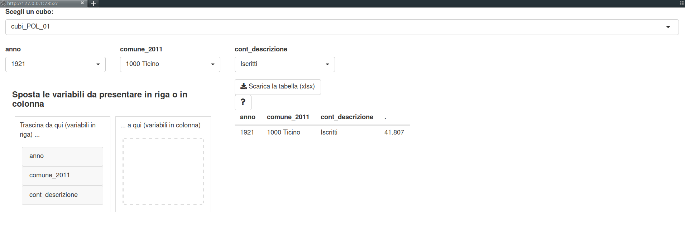

layout: true

background-image: url(immagini/logoTI_slides.png)
background-position: 1.5% 96.5%

---

```{r setup, include=FALSE}
options(htmltools.dir.version = FALSE)
htmltools::tagList(rmarkdown::html_dependency_font_awesome())

knitr::opts_chunk$set(fig.width = 4.75, fig.height = 3.5, fig.retina = 3,
                      message = FALSE, warning = FALSE, cache = FALSE,
                      autodep = TRUE, hiline = TRUE, echo = FALSE, 
                      eval = TRUE)

options(knitr.kable.NA = '')
```


# `cubustat` + `cubiapp` 

- `cubustat` è un pacchetto `R` che contiene i cubi di dati pubblicati dall'Ustat (e i relativi metadati), tutti in formato "long" (`data.table` con le variabili come `factor` e una colonna con i valori).  

--


- `cubiapp` è un pacchetto `R` con un'applicazione shiny per filtrare, ridisporre ed esportare i risultati da dei cubi di dati.

--

- Entrambi i pacchetti possono essere usati in locale, oppure messi su un server. Vedi [gibostat.ch/shiny/cubiapp](https://www.gibostat.ch/shiny/cubiapp)

---


# Installazione e sorgenti

I due pacchetti possono essere installati così:

```{r eval=FALSE, echo=TRUE}
remotes::install_gitlab("gibonet/cubustat")
remotes::install_gitlab("gibonet/cubiapp")
```

--

I codici sorgenti dei due pacchetti sono consultabili a questi link:  
- https://gitlab.com/gibonet/cubustat  
- https://gitlab.com/gibonet/cubiapp  


---


# Esempi di utilizzo (1)

Esempio "predefinito", con i cubi pubblicati sul sito dell'Ustat: 
```{r echo=TRUE, eval=TRUE}
library(cubiapp)

cubi_app4()
```

---

# Esempi di utilizzo (2)

- Di default viene caricata l'applicazione che permette di scegliere tutti i cubi di dati che pubblichiamo sul sito dell'Ustat. L'applicazione prende i cubi dal pacchetto `cubustat`  

--

- È però possibile utilizzare qualsiasi cubo di dati. Il cubo deve essere una `data.table` in formato "long", con delle colonne di tipo `factor` che andranno a comporre i filtri, e una colonna con il valore (questa colonna può essere di qualsiasi tipo).


---

# Esempi di utilizzo (2)

```{r echo=TRUE, eval=TRUE}
library(data.table)
head(cubi_POL_01)
```

---

```{r echo=TRUE, eval=TRUE}
str(cubi_POL_01)
```

Il cubo ha 3 colonne di tipo `factor` (anno, comune_2011 e cont_descrizione), una colonna numerica (valore) e una colonna di tipo `character` (valore_f). Ecco un esempio che carica l'interfaccia con solo un cubo, e con la colonna `valore_f` come valore (vedi prossima slide) 

---

# Risultato del secondo esempio

```{r echo=TRUE, eval=FALSE}
cubi_app4(choices = "cubi_POL_01", valore_tabella = "valore_f")
```

```{r echo=FALSE, eval=TRUE}

```

---


# Esempio statico con `cubustat` e `data.table`

- Cubi contenuti in `cubustat`:
```{r echo=TRUE, eval=TRUE}
library(cubustat)
ls("package:cubustat")
```

---

# Filtrare e ridisporre con `data.table`

- Scegliamo un cubo qualsiasi da `cubustat`:

```{r echo=TRUE, eval=TRUE}
library(data.table)
head(cubi_POL_02)
```


---

# Filtrare

- Selezioniamo alcuni risultati relativi al Ticino e per alcuni anni (iscritti e votanti):
```{r echo=TRUE, eval=TRUE}
res <- cubi_POL_02[
  anno %in% c("2003", "2007", "2011") &
    comune_2011 %in% "1000 Ticino" &
    cont_descrizione %in% c("Iscritti", "Votanti")
]
res
```

---

# Ridisporre (`data.table::dcast()`)

- ... e ridisponiamo i risultati con l'anno nelle righe e il tipo di risultato in colonna:

```{r echo=TRUE, eval=TRUE}
dcast(res, anno ~ cont_descrizione, value.var = "valore_f")
```

--

.font150[
And that's all, folks!
]
